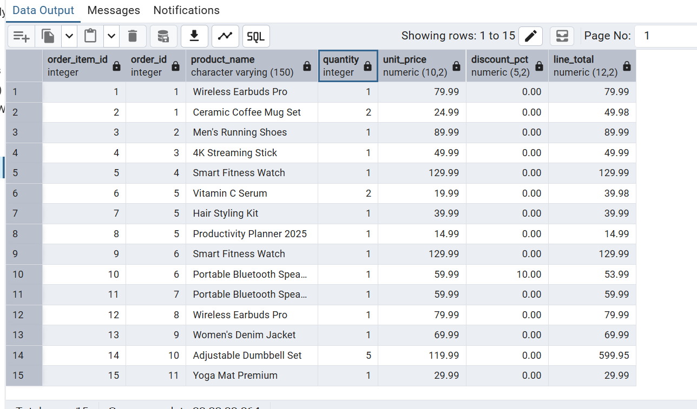
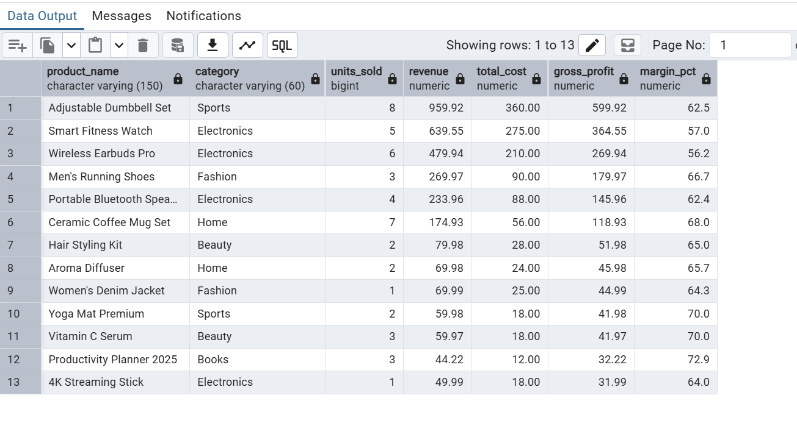
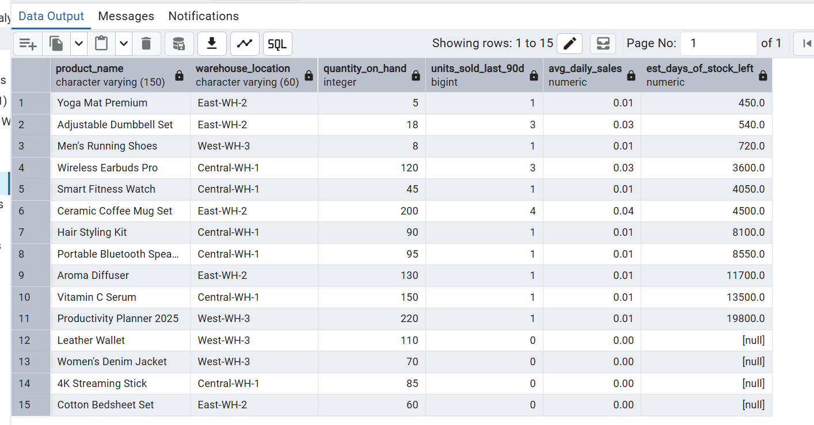
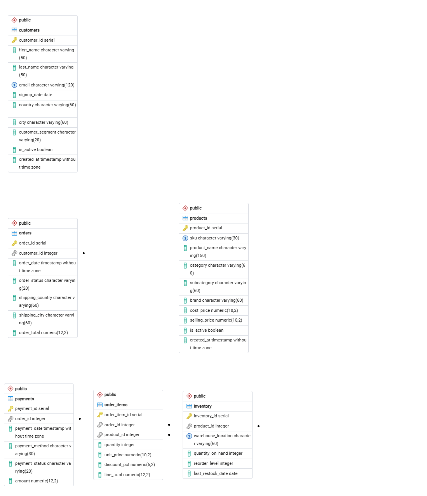

# E-Commerce Analytics Database

A self-contained SQL project modeling a small e-commerce business — customers, products, orders, payments, and inventory — with a full suite of analytics queries covering **revenue**, **customer retention**, **cohort analysis**, and **best-sellers**.

Written for **PostgreSQL** (uses `DATE_TRUNC`, `NTILE`, generated columns, and other window functions). Minor tweaks would be needed to run on MySQL/SQLite.

---

## Project Structure

```
project/
├── README.md                    # This file
├── schema.sql                   # Table definitions, constraints, indexes
├── seed_data.sql                # ~30 orders across 20 customers & 15 products
├── queries/
│   ├── 01_exploration.sql       # Row counts, basic breakdowns, sanity checks
│   ├── 02_analysis.sql          # Revenue, retention, cohort, best-seller queries
│   └── 03_advanced_queries.sql  # RFM segmentation, cohort matrix, CLV, market basket
├── screenshots/                 # Add screenshots of query results / dashboards here
└── data_dictionary.md           # Full column-level reference & ER overview
```

---

## Entity-Relationship Overview

```
customers 1───* orders 1───* order_items *───1 products
                  │                              │
                  1                              1
                  │                              │
                  *                              *
              payments                      inventory
```

| Table | Purpose |
|---|---|
| `customers` | Customer profile + signup date (used for cohorting) |
| `products` | Product catalog with cost & selling price |
| `orders` | Order header (one row per transaction) |
| `order_items` | Order line items (one row per product per order) — the source of truth for revenue |
| `payments` | Payment transactions tied to orders |
| `inventory` | Stock levels per product per warehouse |

See [`data_dictionary.md`](data_dictionary.md) for full column definitions and business rules.

---

## Setup

### 1. Create a database
```bash
createdb ecommerce_analytics
```

### 2. Load the schema
```bash
psql -d ecommerce_analytics -f schema.sql
```

### 3. Load the seed data
```bash
psql -d ecommerce_analytics -f seed_data.sql
```

### 4. Run the queries
```bash
psql -d ecommerce_analytics -f queries/01_exploration.sql
psql -d ecommerce_analytics -f queries/02_analysis.sql
psql -d ecommerce_analytics -f queries/03_advanced_queries.sql
```

Or open any file in your SQL client (DBeaver, TablePlus, pgAdmin, DataGrip, etc.) and run statements individually.

---

## What's in the Queries

### `01_exploration.sql`
Row counts, date ranges, status/segment/category breakdowns, low-stock check — a quick first look at the data.


### `02_analysis.sql`
The core business questions, grouped into four sections:

- **Revenue** — total revenue & AOV, monthly trend, month-over-month growth %, revenue by category/country/segment
- **Retention** — new vs. repeat buyers, repeat purchase rate, purchase frequency distribution, avg. days to second order, month-over-month retained customers
- **Cohort** — cohort sizes by signup month, retention counts by months-since-signup, retention rate %
- **Best-sellers** — top products by revenue, top products by units sold, best-seller per category, profitability/margin leaderboard


### `03_advanced_queries.sql`
More advanced, composite analysis:

- **RFM segmentation** (Recency, Frequency, Monetary) with customer segments like *Champions*, *At Risk*, *Hibernating*
- **Pivoted cohort retention matrix** (the classic month-0 → month-4 heatmap table)
- **Customer Lifetime Value (CLV)** leaderboard
- **Cumulative running revenue** by day
- **Market basket analysis** — products frequently bought together
- **Customer ranking within country** (window functions)
- **Inventory health** — estimated days of stock remaining based on 90-day sales velocity

---

## Sample Data Notes

The seed data intentionally includes:
- A loyal repeat customer (Aarav) with 6 orders spanning Jan–Aug, to make retention/cohort/CLV queries show clear signal.
- A mix of `completed`, `pending`, and `cancelled` orders, and `success`/`refunded`/`pending` payments, to test status filtering.
- Two low-stock products (below `reorder_level`) to exercise inventory queries.
- Customers spread across 7 countries and 3 segments (`regular`, `vip`, `wholesale`).

Feel free to extend `seed_data.sql` with more rows — every query in this project will scale automatically.

---

## Screenshots

Add exported query results, ERD diagrams, or dashboard screenshots to the `screenshots/` folder to document your findings.



